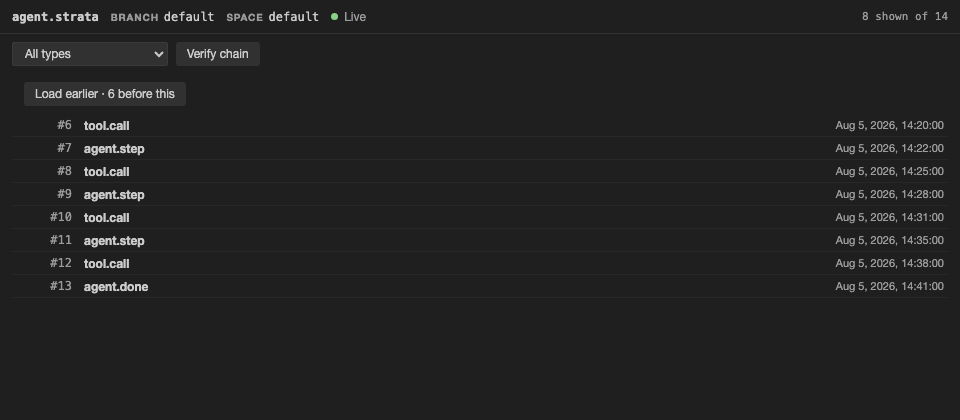
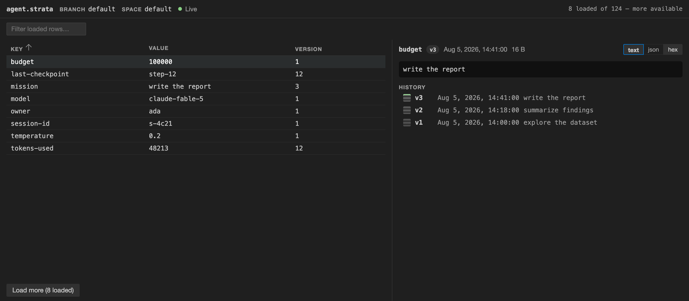
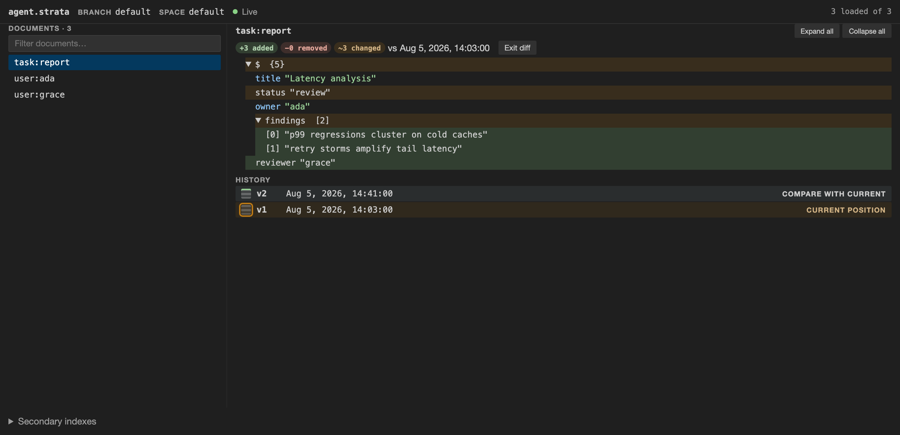
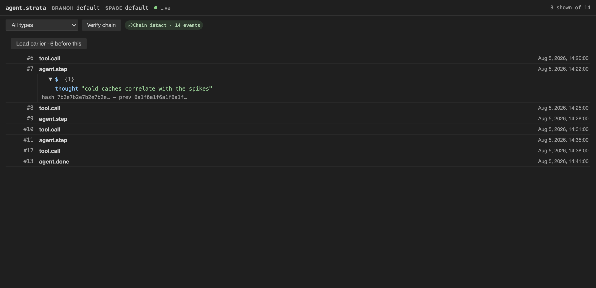
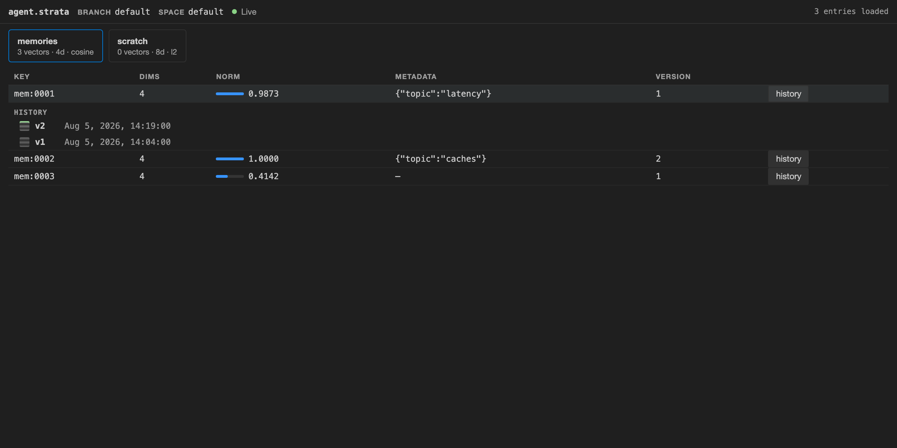
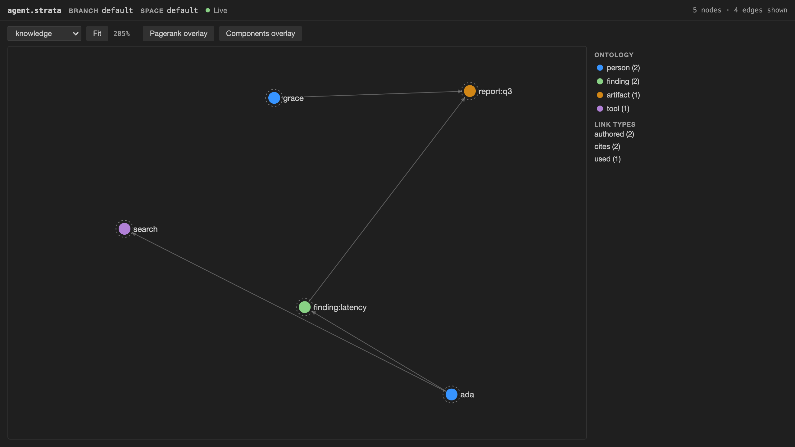
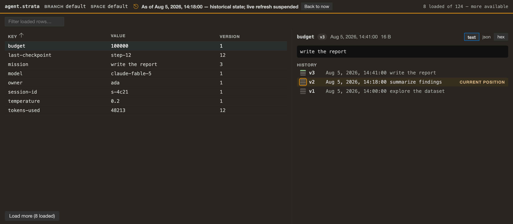

# StrataDB for VS Code

A live window on [Strata](https://stratadb.org) databases inside
the editor: open the folder containing a database, watch your app or agent's
state change as it works, scrub back in time, and inspect any row on any
branch — without ever contending with the app that owns the database.



## What it does

- **Live explorer** — databases → branches → spaces → primitives → entries,
  with counts, capped pages, and explicit *Load more*. Refresh is push-driven
  (version-tick subscriptions); the extension never polls.
- **Primitive views** — each primitive opens into a view shaped like its data:
  a KV table with text/JSON/hex value forms, a JSON document browser with
  copyable paths and a two-version structural diff, a live event feed with
  chain verification, a metadata-first vector browser, and a graph canvas
  built by bounded neighborhood expansion.
- **Branches & time travel** — branch browsing, forked experiment branches,
  branch diff summaries, per-key history timelines, and an `as_of` scrubber:
  pick a version from any timeline and the whole database view moves to that
  moment.
- **Command console** — every read-class command in the executor IDL, runnable
  from schema-generated forms or raw wire JSON with pre-send validation. Results
  open as structured reports with raw JSON kept as an explicit secondary view.
  Write commands are visible but greyed out in the console.
- **Browse and clone from StrataHub** — browse public hub datasets, inspect
  dataset cards, then clone one into a local folder and open it. The direct
  `Strata: Clone Dataset from StrataHub…` command remains for known slugs.
- **Agent enablement** — one consent, and Strata registers itself with your
  AI agents (VS Code agent mode natively; Cursor and Claude Code via
  `.cursor/mcp.json` / `.mcp.json`). Watch the agent's session appear in the
  status bar and its writes stream into the views. The Strata sidebar includes
  an `AI Agent` panel for MCP setup, starter snippets, Strata API docs, and
  inference docs, with database/primitive context-menu shortcuts as backup.
  Branches can also copy a handoff prompt so an agent can switch from the live
  branch to an experiment branch.
- **Setup center** — `Strata: Open Strata Status…` shows binary/version,
  workspace trust, connected databases, MCP registration, Hub URL, 1.2.2-era
  capability readiness, and suggested fixes.

## The views

**Key-value table** — text, JSON, and hex value forms, with each key's history
on a rail beside the detail.



**JSON documents** — copyable paths and a two-version structural diff picked
straight off the timeline.



**Event feed** — hash-chain verification and arrivals that never steal your
place while you read.



**Vectors** — metadata first: dimensions, norms compared at a glance, and
per-entry history.



**Graph** — bounded neighborhood expansion with ontology and link-type
legends.



**Time travel** — the whole database view as of a moment, washed amber until
you come back.



## How it connects

Strata admits one read-write owner per database. Browsing is a **socket client**
of that owner — the extension introduces itself with a hello, declares a
read-only session the owner *enforces*, and subscribes to change ticks. Explicit
write actions such as branch fork and KV/JSON edits run through the trusted
`strata` CLI, then the views re-read through the socket. The extension never
embeds the engine and never takes the writer lock.

Use **Strata: Connect Existing Database…** to pick a database outside the
workspace. If nothing owns that database yet, StrataDB starts a managed
`strata start` host automatically when the workspace is trusted and the CLI is
available. Workspace-discovered databases still show their connection state in
the explorer.

## Requirements

- **strata** ≥ 1.2.2 recommended on `PATH` or at the `strata.binaryPath`
  setting — needed to start hosts, run doctor, clone, browse Hub metadata
  through core, use engine-backed KV prefix paging, serve MCP, display
  wall-clock commit times where available, and run explicit write actions.
  Connecting to an already-running owner needs no binary at all.
- macOS or Linux. The transport is a local Unix socket, so in remote
  development (SSH/WSL/devcontainers) the extension runs where the database
  lives (`extensionKind: workspace`). Windows support is blocked on the
  upstream transport.
- Version skew is detected when connecting via the wire handshake; an owner built
  against a different IDL revision degrades gracefully (unknown commands are
  hidden) rather than failing.

## Trust & privacy

- In **untrusted workspaces** the extension is connect-only: it will connect
  to an existing socket but never executes the `strata` binary (no host
  start, no doctor, no clone, no branch fork, no KV/JSON edits, no agent
  registration). `strata.binaryPath` is machine-scoped and never read from
  workspace settings.
- Row contents never leave the machine; logs redact values by default; the
  webviews are strict-CSP with zero network access. **No telemetry.**

## Settings

| Setting | Purpose |
|---|---|
| `strata.binaryPath` | Path to the strata CLI (machine-scoped) |
| `strata.databases` | Explicit database paths beyond workspace discovery |

## Development

```sh
npm install
npm run generate      # regenerate src/generated from the vendored IDL
npm run test:unit     # fast suite (fake owner)
npm run test:integration  # cross-process suite (needs a strata binary)
npm run build         # bundle extension + webviews
npm run package       # produce the .vsix
npm run storefront    # regenerate media/icon.png + media/readme/ from the harness fixtures
```

The marketplace imagery in `media/readme/` is rendered by `tools/storefront.ts`
from the same bundle and fixtures the visual test matrix uses, so the listing
can't drift from the product. Those files ship via GitHub (vsce rewrites
relative README links), not inside the .vsix.

The IDL artifacts in `idl/v1` are vendored from `strata-core` at the revision
pinned in `idl/v1/STRATA_CORE_REV`. A pin bump is a PR that re-vendors,
regenerates, and passes the coverage guard — never a silent update. CI
enforces regeneration no-diff and that every catalog command is either
surfaced or in the shrink-only ledger under `coverage/`.

The CI integration tier builds `strata` from the pinned rev; it needs the
`STRATAHUB_TOKEN` secret (a fine-grained PAT with read access to
`stratalab/stratahub`) because strata-core git-pins that private repo. The
built binary is cached per OS + pin.

Releases: tag `v*` → the release workflow packages the extension and, when
`VSCE_PAT` / `OVSX_PAT` secrets are configured, publishes to the VS Code
Marketplace and Open VSX.
